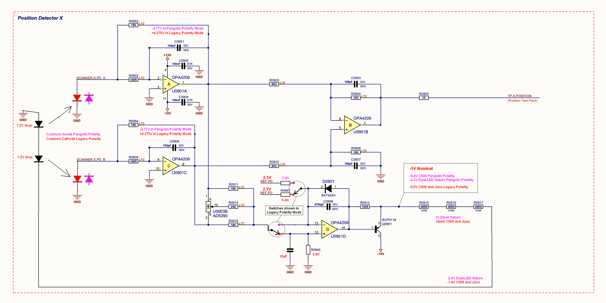

# Photodiode TIA – Position Sensor Circuit

LTspice design and noise analysis for a photodiode transimpedance amplifier (TIA) front-end used in a laser position-detection circuit. The design supports two selectable polarity configurations and was analyzed for output-referred noise across a sliding-blocker illumination sweep.



## Overview

The circuit takes differential photodiode inputs (`PD_A`, `PD_B`) through a pair of transimpedance amplifiers (OPA4209), combines them through a difference/summing stage, and outputs a buffered position signal (`TP.X.POSITION`). A digital potentiometer (AD5290) sets a reference trim, and an analog switch selects between two polarity modes:

- **Legacy Polarity Mode** – common-cathode photodiode wiring, original reference design
- **Pangolin Polarity Mode** – common-anode photodiode wiring, updated design with revised bias points (−4.77 V vs +4.375 V rails)

## Noise Analysis (Phase 1)

Using LTspice behavioral current sources, shot noise was modeled explicitly and tied to photocurrent:

- 0 V `VSENSE` source at the TIA summing node as the `.noise` input reference
- AC = 1 A test current (`IREF`) for AC transimpedance
- `.noise` sweep from 10 Hz – 1 MHz across illumination-split ratios α ∈ {0, 0.25, 0.5, 0.75, 1}, with total photocurrent `Itotal = 10 µA`

**Key LTspice directives**

```spice
.option plotwinsize=0
.noise V(outputnode) VSENSE dec 200 10 1e6
.ac dec 200 10 10Meg
.meas NOISE NO_PWR INTEG V(onoise)*V(onoise) FROM 10 TO 1e6
.meas NOISE NO_RMS PARAM sqrt(NO_PWR)
```

**Result:** Integrated output-referred noise (`NO_RMS`) was invariant across all α steps (≈1.183 mV RMS), consistent with constant total illumination and sliding-blocker behavior — confirming the noise model correctly tracks total photocurrent rather than its split between the two diodes.

| Alpha | NO_RMS (V_rms) |
|-------|-----------------|
| 0     | 0.001182582844  |
| 0.25  | 0.001182582844  |
| 0.5   | 0.001182582844  |
| 0.75  | 0.001182582844  |
| 1.0   | 0.001182582844  |

Full write-up: [`docs/phase1-noise-optimization-report.docx`](./docs/phase1-noise-optimization-report.docx)

## Next Steps (Phase 2)

- Compare Pangolin vs. Legacy polarity using identical shot-noise setup and AGC conditions
- What-if sweeps: `Itotal` scaling (√I), feedback Rf/Cf trade-offs, input 100 Ω effects, optional JFET bootstrapping
- Transimpedance and stability (phase margin) checks per configuration

## Repo Contents

```
design-files/     Original LTspice schematics (.asc) and simulation logs for both polarity modes
edited-version/   Revised/edited version of the Pangolin polarity schematic + netlist
images/           Full system schematic (position detector block)
docs/             Phase 1 noise optimization report (.docx)
```

> Note: Raw binary LTspice simulation output (`.raw`, `.op.raw`, `.db`) is omitted from this repo since it's not human-readable and bloats repo size. Open the `.asc` files directly in [LTspice](https://www.analog.com/en/design-center/design-tools-and-calculators/ltspice-simulator.html) to re-run simulations and regenerate them.
